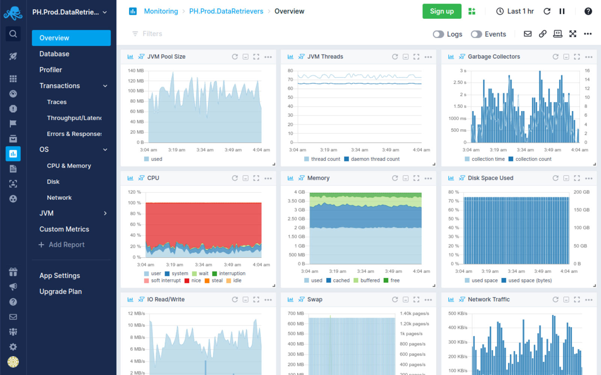

<h1 align="center">
  <a name="logo" href="https://www.sematext.com"></a>
  <br>
  Sematext Cloud - Terraform Examples
</h1>
<h4 align="center">
    Getting started with Terraform and the <a href="https://registry.terraform.io/providers/sematext/sematext/latest">Sematext Cloud Terraform Provider</a>
</h4>

<div align="center">
  <h4>
    </a>    
    </a>
    <a href="https://github.com/sematext/terraform-provider-sematext"></a>
    <a href="https://github.com/sematext/terraform-examples/commits/master"></a>
    <a href="https://gitter.im/hashicorp-terraform/Lobby"></a>
  </h4>
</div>
<p><font size="3">
Examples of using Terraform scripting to automate <a href="https://sematext.com/cloud/">Sematext Cloud</a> monitoring, logging and metric integration alongside your solution.
</p>
<div align="center"><a name="menu"></a>
  <h4>
    <a href="#terraform-resources">Terraform Resources</a>
    <span> | </span>
    <a href="#requirements">Requirements</a>
    <span> | </span>
    <a href="#authentication">Authentication</a>
    <span> | </span>
    <a href="#getting-started">Getting Started</a>
    <span> | </span>
    <a href="./examples">Examples</a>
  </h4>
</div>
<hr>
<h4 align="center">
Sematext is now a Terraform Verified Partner! You can access the Sematext Cloud Provider in the
<a href="https://registry.terraform.io/providers/sematext/sematext/latest">Terraform Registry</a> 
</h4>
<hr>

#### <a name="resources"></a>Sematext Monitoring App Resources supported by this Provider:

<table align="center" border="0" width="100%">
<tbody>
<tr>
<td align="center">

[](https://registry.terraform.io/providers/sematext/sematext/latest/docs/resources/sematext_monitor_solr)

</td>
<td align="center">

[](https://registry.terraform.io/providers/sematext/sematext/latest/docs/resources/sematext_monitor_solrcloud)
</td>
<td align="center">

[](https://registry.terraform.io/providers/sematext/sematext/latest/docs/resources/sematext_monitor_elasticsearch)
</td>
<td align="center">

[](https://registry.terraform.io/providers/sematext/sematext/latest/docs/resources/sematext_monitor_nodejs)
</td>
</tr>
<tr>
<td align="center">

[](https://registry.terraform.io/providers/sematext/sematext/latest/docs/resources/sematext_monitor_spark)
</td>
<td align="center">

[](https://registry.terraform.io/providers/sematext/sematext/latest/docs/resources/sematext_monitor_kafka)
</td>
<td align="center">

[](https://registry.terraform.io/providers/sematext/sematext/latest/docs/resources/sematext_monitor_docker)
</td>
<td align="center">

[](https://registry.terraform.io/providers/sematext/sematext/latest/docs/resources/sematext_monitor_cassandra)
</td>
</tr>
<tr>
<td align="center">

[](https://registry.terraform.io/providers/sematext/sematext/latest/docs/resources/sematext_monitor_hbase)
</td>
<td align="center">

[](https://registry.terraform.io/providers/sematext/sematext/latest/docs/resources/sematext_monitor_hadoopmrv1)
</td>
<td align="center">

[](https://registry.terraform.io/providers/sematext/sematext/latest/docs/resources/sematext_monitor_mongodb)
</td>  
<td align="center">

[](https://registry.terraform.io/providers/sematext/sematext/latest/docs/resources/sematext_monitor_storm)
</td>
</tr>
<tr>
<td align="center">

[](https://registry.terraform.io/providers/sematext/sematext/latest/docs/resources/sematext_monitor_awsec2)
</td>
<td align="center">

[](https://registry.terraform.io/providers/sematext/sematext/latest/docs/resources/sematext_monitor_awsebs)
</td>
<td align="center">

[](https://registry.terraform.io/providers/sematext/sematext/latest/docs/resources/sematext_monitor_awselb)
</td>
<td align="center">

[](https://registry.terraform.io/providers/sematext/sematext/latest/docs/resources/sematext_monitor_tomcat)
</td>
</tr>
<tr>
<td align="center">

[](https://registry.terraform.io/providers/sematext/sematext/latest/docs/resources/sematext_monitor_apache)
</td>
<td align="center">

[](https://registry.terraform.io/providers/sematext/sematext/latest/docs/resources/sematext_monitor_nginxplus)
</td>
<td align="center">

[](https://registry.terraform.io/providers/sematext/sematext/latest/docs/resources/sematext_monitor_redis)
</td>
<td align="center">

[](https://registry.terraform.io/providers/sematext/sematext/latest/docs/resources/sematext_monitor_mysql)
</td>
</tr>

<tr>
<td align="center">

[](https://registry.terraform.io/providers/sematext/sematext/latest/docs/resources/sematext_monitor_zookeeper)
</td>
<td align="center">

[](https://registry.terraform.io/providers/sematext/sematext/latest/docs/resources/sematext_monitor_haproxy)
</td>
<td align="center">

[](https://registry.terraform.io/providers/sematext/sematext/latest/docs/resources/sematext_monitor_jvm)
</td>
<td align="center">

[](https://registry.terraform.io/providers/sematext/sematext/latest/docs/resources/sematext_monitor_akka)
</td>
</tr>


<tr>
<td align="center">

[](https://registry.terraform.io/providers/sematext/sematext/latest/docs/resources/sematext_monitor_postgresql)
</td>
<td align="center">

[](https://registry.terraform.io/providers/sematext/sematext/latest/docs/resources/sematext_monitor_mobilelogs)
</td>
<td align="center">

[](https://registry.terraform.io/providers/sematext/sematext/latest/docs/resources/sematext_monitor_rabbitmq)
</td>
<td align="center">

[](https://registry.terraform.io/providers/sematext/sematext/latest/docs/resources/sematext_monitor_clickhouse)
</td>
</tr>


</tbody>
</table>
<hr>
<table border="0">
<tbody>
<tr>
<td>
</td>
<td>

</td>
</tr>
</table>
<hr>

#### <a name="requirements"></a>Requirements:

* [Terraform v0.13+](https://www.terraform.io/downloads.html) 
* [Sematext Cloud Account](https://apps.sematext.com/ui/account)
* [Sematext Cloud API Access Token](https://apps.sematext.com/ui/account/api)
* [Sematext Cloud Plan ID](https://github.com/sematext/terraform-provider-sematext/blob/master/docs/guides/plans.md)

<hr>

#### <a name="authentication"></a>Authentication:

These Terraform examples talk to Sematext Cloud and require a Sematext Cloud Access token to function. <br>
You can find this by logging into your [Sematext Cloud Account](https://apps.sematext.com/ui/account/api)

<hr>

#### <a name="gettingstarted"></a>Getting Started:


In your environment you will have the following environment vars:

```sh
SEMATEXT_API_KEY="<your access key>"
SEMATEXT_REGION="<US or EU>"
```

Additionally, if you will be deploying a Sematext Cloud monitoring app that will talk to AWS you will also need:

```sh
AWS_ACCESS_KEY_ID="<aws access key>"
AWS_SECRET_ACCESS_KEY= "<aws secret key>"
AWS_REGION = "<aws region>"
```

In the simplest case a file will contain the following Terraform hcl snippet: 

```hcl
terraform {
  required_providers {
    sematext = {
      source = "sematext/sematext"
      version = "0.1.2"
    }
  }
}

provider "sematext" {
    # provider configuration
}

resource "sematext_monitor_mongodb" "monitor_mongodb" {
    name = "MongoDB Monitor"
    billing_plan_id = 125 
}
```


```bash
$ terraform init
$ terraform plan
$ terraform apply
```

*Note this particular example is a simple demo as a starting point, refer to more realistic examples listed in the [examples directory](./examples).*

<hr>


#### <a name="otherresources"></a>Further Information:

* Sematext Manual Integrations Guide :https://sematext.com/docs/guide/integrations-guide/
* Terraform Website: https://www.terraform.io
* Mailing list: [Google Groups](http://groups.google.com/group/terraform-tool)
* [](https://gitter.im/hashicorp-terraform/Lobby)
